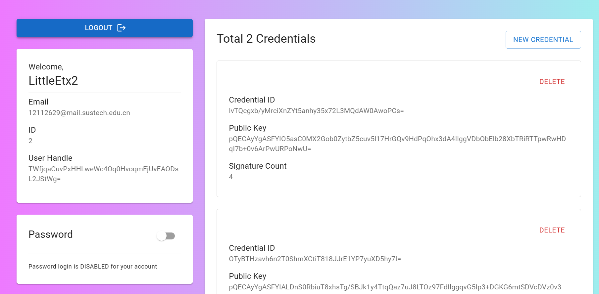

# Passkey Demo - Client

This is a simple client that bridges the [Webauthn](https://fidoalliance.org/fido2-2/fido2-web-authentication-webauthn/)
and
the [CTAP](https://fidoalliance.org/specs/fido-v2.2-rd-20230321/fido-client-to-authenticator-protocol-v2.2-rd-20230321.html)
protocals. The UI is built using [React](https://reactjs.org/). For simulation propose, the client not only calls
the `navigator.credentials.get()` and `navigator.credentials.create()` functions that use platform authenticators, but
also implements the CTAP2.1 protocal to communicate with the [PasskeySync](https://github.com/PasskeySync/passkey-sync)
Authenticator.

Password login is also available.

Aftering loging in, user can see all the credentials that binds to the account as well as turn on / off password login.

## Screen Shots

## How to run

1. Clone the repo
2. Run `npm install`
3. Run `react-scripts start`

Please also run the [replying party server](https://github.com/PasskeySync/relying-party-server) to ensure all the API
works.
The PasskeySync part also requires PasskeySync running on local machine.